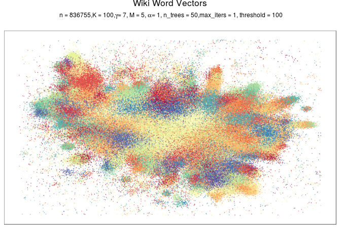

[](https://github.com/elbamos/largeVis/actions/workflows/rhub.yaml)

This is an implementation of the `largeVis` algorithm described in (https://arxiv.org/abs/1602.00370).  It also incorporates:

*	A very fast algorithm for estimating k-nearest neighbors, implemented in C++ with `Rcpp` and `RcppParallel`, using `RcppAnnoy` for the ANNOY phase of the algorithm. 
* Efficient implementations of the clustering algorithms:
	+	`HDBSCAN`
	+ `OPTICS`
	+ `DBSCAN`
* Functions for visualizing manifolds like [this](http://cs.stanford.edu/people/karpathy/cnnembed/).

### News Highlights

* Version 0.3.0 is a major update. `OpenMP` has been replaced by `RcppParallel`. My homegrown implementation of the ANNOY phase of the ANN algorithm is replaced by `RcppAnnoy`. This was done because of the varying availability of `OpenMP` on many systems (e.g., OS X). Performance appears to be improved considerably, and more distance metrics are available, unfortunately at the expense of breaking changes to several functions. See [NEWS](./NEWS.md) for full details.
* Version 0.1.10 re-adds clustering, and also adds momentum training to largeVis, as well as a host of other features and improvements.
* Version 0.1.9.1 has been accepted by CRAN. Much grattitude to Uwe Ligges and Kurt Hornik for their assistance, advice, and patience. 

### Some Examples




### Clustering With HDBSCAN

```{r clustering,echo=F,warning=F}
library(clusteringdatasets)
library(largeVis, quietly = TRUE)
library(ggplot2)
data(Aggregation)
vis <- largeVis(t(as.matrix(Aggregation[, 1:2])), sgd_batches = 1)
clusters <- hdbscan(vis, K = 2)

theme_set(
  theme_bw() %+replace%
  theme(
    legend.title = element_text(size = rel(0.8),
                              face = "bold"),
    legend.margin = unit(0, "cm"),
    legend.position = "right",
    legend.key.size = unit(2, "lines"),
    legend.text = element_text(size = unit(8, "points")), 
    axis.title.y = element_text(angle = 90),
    axis.text = element_text(size = rel(0.7)),
    plot.margin = unit(c(0, 0.5, 1, 0), "lines"), 
    axis.title = element_text(size = rel(0.8),
                              face = "bold"),
    title = element_text(size = rel(0.9))
  ) 
)

show(gplot(clusters, Aggregation[, 1:2]) +
		 	scale_x_continuous("", labels = NULL) +
		 	scale_y_continuous("", labels = NULL))
```

### Visualize Embeddings


