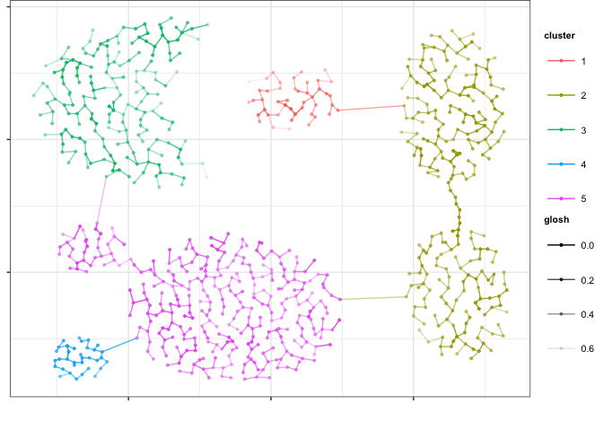

largeVis
================

   

This is an implementation of the `largeVis` algorithm described in (<https://arxiv.org/abs/1602.00370>). It also incorporates:

-   A very fast algorithm for estimating k-nearest neighbors, implemented in C++ with `Rcpp` and `OpenMP`. See the [Benchmarks](./benchmarks.md) file for performance details.
-   Efficient implementations of the clustering algorithms:
    -   `HDBSCAN`
    -   `OPTICS`
    -   `DBSCAN`
-   Functions for visualizing manifolds like [this](http://cs.stanford.edu/people/karpathy/cnnembed/).

### News Highlights

-   Version 0.1.10 re-adds clustering, and also adds momentum training to largeVis, as well as a host of other features and improvements.
-   Version 0.1.9.1 has been accepted by CRAN. Much grattitude to Uwe Ligges and Kurt Hornik for their assistance, advice, and patience.

### Some Examples

### Clustering With HDBSCAN

### Visualize Embeddings

#### Building Notes

-   **Note on R 3.4**: Before R 3.4, the CRAN binaries were likely to have been compiled without OpenMP, and getting OpenMP to work on Mac OS X was somewhat tricky. This should all have changed (for the better) with R 3.4, which natively using `clang 4.0` by default. Since R 3.4 is new, I'm not able to provide advice, but am interested in hearing of any issues and any workarounds to issues that you may discover.
