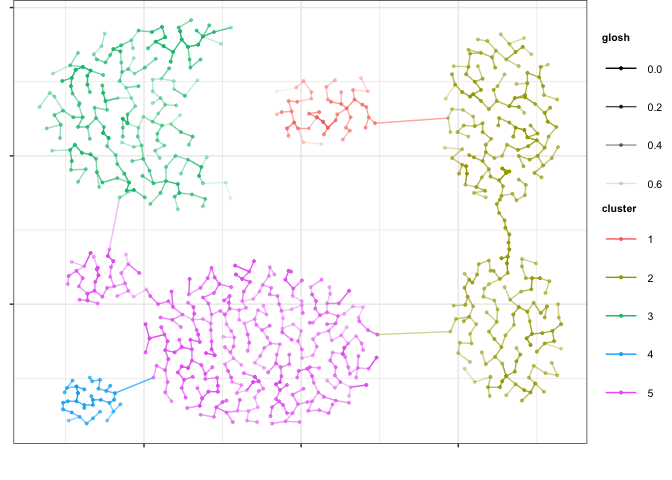

largeVis
================

This is an implementation of the `largeVis` algorithm described in
(<https://arxiv.org/abs/1602.00370>). It also incorporates:

- A very fast algorithm for estimating k-nearest neighbors, implemented
  in C++ with `Rcpp` and `RcppParallel`, using `RcppAnnoy` for the ANNOY
  phase of the algorithm.
- Efficient implementations of the clustering algorithms:
  - `HDBSCAN`
  - `OPTICS`
  - `DBSCAN`
- Functions for visualizing manifolds like
  [this](http://cs.stanford.edu/people/karpathy/cnnembed/).

### News Highlights

- Version 0.3.0 is a major update. `OpenMP` has been replaced by
  `RcppParallel`. My homegrown implementation of the ANNOY phase of the
  ANN algorithm is replaced by `RcppAnnoy`. This was done because of the
  varying availability of `OpenMP` on many systems (e.g., OS X).
  Performance appears to be improved considerably, and more distance
  metrics are available, unfortunately at the expense of breaking
  changes to several functions. See [NEWS](./NEWS.md) for full details.
- Version 0.1.10 re-adds clustering, and also adds momentum training to
  largeVis, as well as a host of other features and improvements.
- Version 0.1.9.1 has been accepted by CRAN. Much grattitude to Uwe
  Ligges and Kurt Hornik for their assistance, advice, and patience.

### Some Examples

<figure>

<figcaption aria-hidden="true">MNIST</figcaption>
</figure>

<figure>

<figcaption aria-hidden="true">Wiki Words</figcaption>
</figure>

### Clustering With HDBSCAN

<!-- -->

### Visualize Embeddings

<figure>

<figcaption aria-hidden="true">Visualize Embeddings</figcaption>
</figure>
