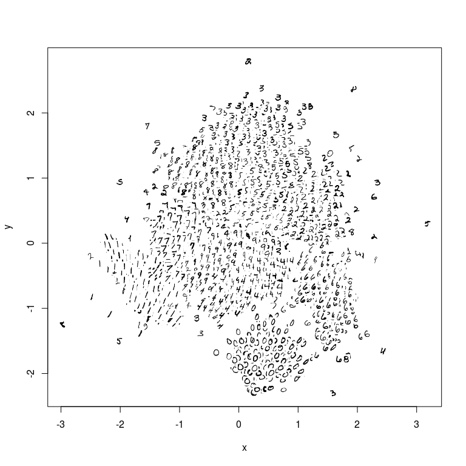

largeVis
================

[](https://travis-ci.org/elbamos/largeVis) [](https://codecov.io/github/elbamos/largeVis?branch=master)[](https://gitter.im/elbamos/largeVis?utm_source=badge&utm_medium=badge&utm_campaign=pr-badge&utm_content=badge)

This is an implementation of the `largeVis` algorithm described in (<https://arxiv.org/abs/1602.00370>). It also incorporates code for a very fast algorithm for estimating k-nearest neighbors, and for visualizing a map of the manifold.

The inner loops for nearest-neighbor search and gradient descent are implemented in C++ using `Rcpp` and `RcppArmadillo`.

#### Project Status & Caveats

-   It works! I have now tested with datasets of up to 1 Million rows.
-   The OpenMP issues in the original upload have been resolved, and OpenMP re-enabled.
-   Memory efficiency has been *vastly* improved in 0.1.3. Peak memory consumption on MNIST is now closer to 2GB (down from 8GB). Several phases of the algorithm are also now much faster.
-   Not yet working:
    -   The alternative distance function (*α* = 0) is not fully implemented.
    -   The visualization map function has had minimal testing, and the transparency feature does not yet work as intended.
-   This project is under heavy development.
-   I am attempting to replicate the paper's results with larger and larger datasets. This takes time because my hardware is not as powerful as the authors'. If you have any to volunteer, please contact me!
-   Please let me know if you have issues compiling it to work with OpenMP. I had some early reports of issues on Fedora 22, but they seem to have been resolved with version 0.1.1.

#### Examples:

##### MNIST

``` r
load("./mnist.Rda")
dat <- mnist$images
dim(dat) <- c(42000, 28 * 28)
dat <- (dat / 255) - 0.5
dat <- t(dat)
coords <- vis(dat, check=FALSE,
                   n_tree = 50, tree_th = 700,
                   K = 100,  max.iter = 1)
```


``` r
flip <- function(x) apply(x,2,rev)
rotate <- function(x) t(flip(x))

mnistimages <- apply(mnist$images,
    MARGIN=1,
    FUN = function(x) as.array(rotate(flip(x))))
mnistimages <- t(mnistimages)
dim(mnistimages) <- c(42000, 28, 28)
coords <- as.matrix(coords[,1:2])
coords <- scale(coords)
manifoldMap(coords,
    n = 5000,
    scale = 0.005,
    transparency = FALSE,
    images = mnistimages,
    xlab="", ylab="",
    xlim = c(-2.5, 2.5), 
    ylim = c(-2.5, 2.5))
```


