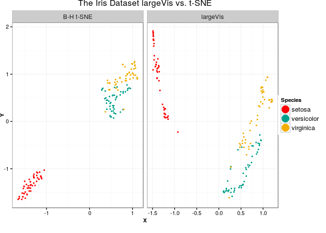

largeVis
================

[](https://travis-ci.org/elbamos/largeVis) [](https://codecov.io/github/elbamos/largeVis?branch=master)

This is an implementation of the `largeVis` algorithm described in (<https://arxiv.org/abs/1602.00370>). It also incorporates code for a very fast algorithm for estimating k-nearest neighbors.

The inner loops for nearest-neighbor search and gradient descent are implemented in C++ using `Rcpp` and `RcppArmadillo`. (If you get an error that a `NULL value passed as symbol address` this relates to `Rcpp` and please open an issue here.)

#### Project Status & Caveats

-   It works!
-   This project is under heavy development.
-   I am attempting to replicate the paper's results with larger and larger datasets. This takes time because my hardware is not as powerful as the authors'. If you have any to volunteer, please contact me!
-   Note that your installation of R must be configured to work with OpenMP. I have had a report that on Federa 22, even small datasets could not be processed because of exceeding the C stack space. If you experience any compilation issues or similar crashes, please create an issue.

#### Examples:

##### Iris

``` r
library(largeVis,quietly=T)
data(iris)
dat <- as.matrix(iris[,1:4])
dat <- scale(dat)
dupes = which(duplicated(dat))
dat <- dat[-dupes,]
visObject <- vis(dat, pca.first = F, 
                   max.iter = 20, sgd.batches = 800000, 
                   K = 10,  gamma = 2, rho = 1, M = 40, alpha = 20,verbose=F)
```



##### MNIST

``` r
load("./mnist.Rda")
dat <- mnist$images
dim(dat) <- c(42000, 28 * 28)
dat <- (dat / 255) - 0.5
coords <- vis(dat, pca.f = F, 
                   n.tree = 10, tree.th = 40, 
                   K = 40, sgd = 20000 * 42000, alpha = 1, max.iter = 10)
save(coords, file = "./mnistcoords.Rda")
```


