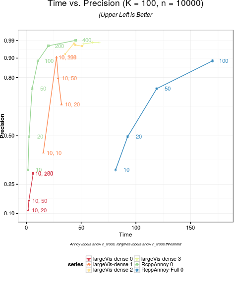
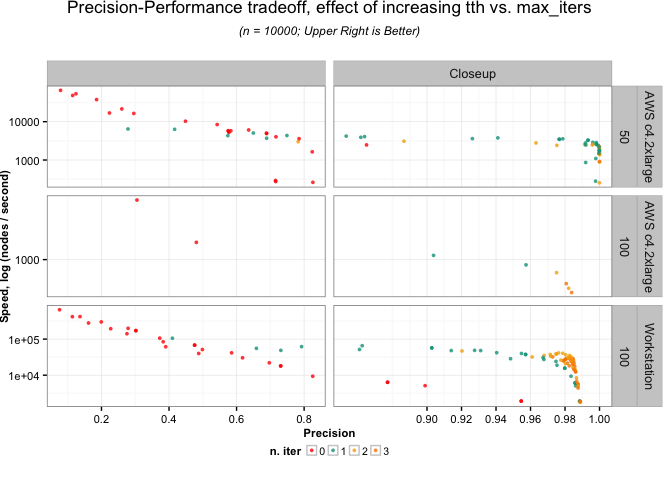

largeVis
================

[](https://travis-ci.org/elbamos/largeVis) [](https://codecov.io/github/elbamos/largeVis?branch=%22) [](https://gitter.im/elbamos/largeVis?utm_source=badge&utm_medium=badge&utm_campaign=pr-badge&utm_content=badge) [](https://ci.appveyor.com/project/elbamos/largeVis)

This is an implementation of the `largeVis` algorithm described in (<https://arxiv.org/abs/1602.00370>). It also incorporates a very fast algorithm for estimating k-nearest neighbors, implemented in C++ with `Rcpp` and `OpenMP`, and for visualizing a map of the manifold like [this](http://cs.stanford.edu/people/karpathy/cnnembed/).

#### Project Status & Caveats

-   Support for sparse matrices!
-   Now tested with (dense) matrices &gt; 2.5 Million rows, and sparse matrices with &gt; 10,000 features.
-   Performance is good. Memory efficiency is still an issue, but can be improved further by using utility functions to perform the algorithm in stages. (Explained in the vignette.)
-   Not yet fully tested:
    -   The alternative distance function (*α* = 0).
-   I am attempting to replicate the paper's results with larger datasets. This takes time because my hardware is not as powerful as the authors'. If you have any to volunteer, please contact me!

#### To-do's Before Submission to CRAN

-   Demonstrate correctness by visualizing the wiki-doc and wiki-term datasets used in the paper. **wikiwords done, pending wikidoc**
-   Compile more-complete benchmarks from a server. **Done, deciding how to visualize.**
-   Confirm that the map visualization function works with color images. **DONE**
-   Give Erik B. a few days to comment on the performance.
-   Reduce submission size

Vignette
--------

This Vingette provides an overview of the largeVis package.

Introduction
------------

This package provides `LargeVis` visualizations and fast nearest-neighbor search. The `LargeVis` algorithm, presented in Tang et al. (2016), creates high-quality low-dimensional representaitons of large, high-dimensional datasets, similar to [t-SNE](https://lvdmaaten.github.io/tsne/).

These visualizations are useful for data exploration, for visualizing complex non-linear functions, and especially for visualizing embeddings such as learned vectors for images.

A limitation of t-SNE is that because the algorithm has complexity order *O*(*n*<sup>2</sup>), it is not feasible for use on even moderately sized datasets. [Barnes-Hut](https://arxiv.org/pdf/1301.3342.pdf), an approximation of t-SNE, has complexity *O*(*n*log*n*) but also quickly becomes infeasible as the size of data grows. `LargeVis` is intended to address the issue by operating in linear *O*(*n*) time. It has been benchmarked at more than 30x faster than Barnes-Hut on datasets of approximately 1-million rows, and scaled linearly as long as there is sufficient RAM.

In addition, `LargeVis` includes an algorithm for finding approximate k-Nearest Neighbors in *O*(*n*) time. This algorithm turns out to be faster at finding accurate a-NNs than any other method I was able to test.

The package also includes a function for visualizing image embeddings by plotting images at the locations given by the `LargeVis` algorithm.

For a detailed description of the algorithm, please see the original paper, Tang et al. (2016).

Package Overview
----------------

The `largeVis` package offers four functions for visualizing high-dimensional datasets and finding approximate nearest neighbors (along with some helper functions):

1.  `randomProjectionTreeSearch`, a method for finding approximate nearest neighbors.
2.  `projectKNNs`, which takes as input a weighted nearest-neighbor graph and estimates a projection into a low-dimensional space.
3.  `vis`, which implements the entire `LargeVis` algorithm.
4.  `manifoldMap` (and companon `ggManifoldMap`), which produce a plot for visualizing embeddings of images.

See the [original paper](https://arxiv.org/abs/1602.00370) for a detailed description of the algorithm.

Data Preparation
----------------

For input to `largeVis`, data should be scaled, NA's, Infs and NULL removed, and transposed from the R-standard so that examples are columns and features are rows. Duplicates should be removed as well.

If there are NA's, Infs, or NULLs in the input, `randomProjectionTreeSearch` will definitely fail.

If the numerical range covered by the data is large, this can cause errors in or before the `buildEdgeMatrix` function. This is because the algorithm requires calculating $\\exp(||\\vec{x\_i}, \\vec{x\_j}||^2)$ in the high-dimensional space, which will overflow if the distance between any nearest neighbors exceeds about 26.

If there are duplicates in the input data, while the implementation tries to filter duplicates, it is likely to lead to problems. If the number of duplicates is large, this can cause the random projection tree search to fail. If the number is small, the algorithm may identify a sufficient number of neighbors, but an error may then occur during `buildEdgeMatrix`, or stochastic gradient descent.

Examples
--------


Overview of Functions and Hyperparameters
-----------------------------------------

### `randomProjectionTreeSearch`

This function uses a two-phase algorithm to find approximate nearest neighbors. In the first phase, which is based on [Erik Bernhardsson](http://erikbern.com)'s [Annoy](https://github.com/spotify/annoy) algorithm, `n_trees` trees are formed by recursively dividing the space by hyperplanes until at most `tree_threshold` nodes remain in a branch. A node's candidate nearest neighbors are the union of all nodes with which it shared a leaf on any of the trees. The `largeVis` algorithm adds a second phase, neighborhood exploration, which considers, for each node, whether the candidate neighbors of the node's candidate immediate neighbors are closer. The logic of the algorithm is that a node's neighbors' neighbors are likely to be the node's own neighbors. In each iteration, the closest `K` candidate neighbors for each node are kept.

(Note that this implementation of `largeVis` differs from the approach taken by `Annoy`, in that `Annoy` always uses the number of features as the leaf threshold, where `largeVis` allows this to be an adjustable parameter.)

The authors of Tang et al. (2016) suggest that a single iteration of the second phase is generally sufficient to obtain satisfactory performance.

See the vignette "ANN Benchmarks" for additional information.

### `projectKNNs`

This function takes as its input a `Matrix::sparseMatrix`, of connections between nodes. The matrix must be symmetric. A non-zero cell implies that node `i` is a nearest neighbor of node `j`, vice-versa, or both. Non-zero values represent the strength of the connection relative to other nearest neighbors of the two nodes.

The `LargeVis` algorithm, explained in detail in Tang et al. (2016), estimates the embedding by sampling from the identitied nearest-neighbor connections. For each edge, the algorithm also samples `M` non-nearest neighbor negative samples. `M`, along with *γ* and *α*, control the visualization. *α* controls the desired distance between nearest neighbors. *γ* controls the relative strength of the attractive force between nearest neighbors and repulsive force between non-neighbors.

The following grid illustrates the effect of the *α* and *γ* hyperparameters, using the `wiki` dataset which is included with the package:


The additional hyperparameters *ρ* and `min-`*ρ* control the starting and final learning rate for the stochastic gradient descent process.

The algorithm can treat positive edge weights in two different ways. The authors of Tang et al. (2016) suggest that edge weights should be used to generate a weighted sampling. However, the algorithm for taking a weighted sample runs in *O*(*n*log*n*). Alternatively, the edge-weights can be applied to the gradients. This is controlled by the `weight_pos_samples` parameter.

### `vis`

The `vis` function combines `randomProjectionTreeSearch` and `projectKNNs`, along with additional logic for calculating edge weights, to implement the complete `LargeVis` algorithm.

The following chart illustrates the effect of the `M` and `K` parameters, using the `iris` dataset. Each row re-uses the same set of identified `K` neighbors, and initial coordinates.


### `manifoldMap`

The `manifoldMap` function is useful when the examples being clustered are themselves images. Given a coordinate matrix (as generated by `projectKNNs` or `vis`) and an `array` of `N` images, the function samples `n` images and plots them at the coordinates given in the matrix.

The function can plot both color and greyscale images.

#### Example with MNIST Letters

5000 images sampled from the MNIST dataset, plotted at positions generated by `vis`:

``` r
dim(trainData) <- c(60000, 28, 28)
aperm(trainData, perm = c(1,3,2), resize = FALSE)
set.seed(1974)
manifoldMap(mnistCoords[,1:2],
    n = 5000,
    scale = 0.1,
    images = trainData,
    xlab = "", 
    ylab = "")
```


#### Example with Faces

The following examples visualize facial-recognition embedding vectors from the [Labelled Faces in the Wild](http://vis-www.cs.umass.edu/lfw/) dataset. The embedding vectors were graciously provided by [Brandon Amos](https://bamos.github.io/) of the [OpenFace](https://cmusatyalab.github.io/openface/) project. Similar vectors may be generated for images using the OpenFace `batch-represent` command.

OpenFace embedding vectors encode an image in such a way that the embeddings for multiple images of the same person should be similar. This is illustrated on the first plot below, which highlights the locations of the embedding vectors for images of 10 selected individuals.


The function of `manifoldMap` is illustrated in the following plot, which places 500 images from the dataset at the locations given by the `largeVis` map.


A high resolution version is available [here](vignettes/faceshighres.png) Note what the plot is showing. The positions of the faces in [Karpathy's embedding plots](http://cs.stanford.edu/people/karpathy/cnnembed/) are highly sensitive to the background and overall sense of each image, because Karpathy used embedding vectors produced by a general-purpose model. In the plot of the OpenFace vectors above, the positions are insensitive to the image backgrounds -- but pictures of the same individual are plotted close to each other, and close to similar-looking persons.

Support for Sparse Matrices
---------------------------

`largeVis` supports sparse matrices. Besides facilitating very large datasets, this makes it practicable to visualize term-document-matrices.

For example, the following plot visualizes a corpus of 5000 political blog entries, as included with the `stm` package. The first row visualizes the blog entries as tf-idf weighted term vectors; the second, as topic vectors.


This facilitates evaluation of the effectiveness of a topic model. In the example above, `stm` is asked to create a 20-topic model that is aware that blogs marked "liberal" and blogs marked "conservative" may talk about the same topics in different ways. As expected, the `largeVis` visualization of this model shows blog entries that group into 20 clusters, with "liberal" and "conservative" blogs each addressing, but placing different weights on, each of the 20 topics.

Visualizing Graphs
------------------

The `largeVis` visualization algorithm can be used to visualize ordinary graphs. The included `wiki` dataset is an example.

The following code illustrates how to import and visualize a graph using the YouTube-communities dataset available [here](https://snap.stanford.edu/data/com-Youtube.html). The data and visualization are not included here for size reasons.

``` r
pathToGraphFile <- 
  "./YouTubeCommunities/com-youtube.ungraph.txt"
pathToCommunities <- 
  "./YouTubeCommunities/com-youtube.top5000.cmty.txt"

youtube <- readr::read_tsv(pathToGraphFile, skip=4, col_names=FALSE)
youtube <- as.matrix(youtube)
youtube <- Matrix::sparseMatrix(i = youtube[, 1],
                                j = youtube[, 2],
                                x = rep(1, nrow(youtube)), 
                                dims = c(max(youtube), max(youtube)))
youtube <- youtube + t(youtube)
communities <- readr::read_lines(pathToCommunities)
communities <- lapply(communities, 
                      FUN = function(x) as.numeric(unlist(strsplit(x, "\t"))))
community_assignments <- rep(0, 
                             nrow(youtube))
for (i in 1:length(communities)) community_assignments[communities[[i]]] <- i

youTube_coordinates <- projectKNNs(youtube)
youTube_coordinates <- data.frame(scale(t(youTube_coordinates)))
colnames(youTube_coordinates) <- c("x", "y")
youTube_coordinates$community <- factor(community_assignments)
youTube_coordinates$alpha <- factor(ifelse(youTube_coordinates$community == 0, 0.05, 0.2))
ggplot(youTube_coordinates, aes( x = x, 
                      y = y, 
                      color = community, 
                      alpha = alpha, 
                      size = alpha)) +
  geom_point() +
  scale_color_manual(values = 
                       c("black", colors_continuous(5000)),
                     guide = FALSE) +
  scale_alpha_manual(values = c(0.005, 0.2), guide = FALSE) +
  scale_size_manual(values = c(0.03, 0.15), guide = FALSE) +
  scale_x_continuous("", 
                     breaks = NULL, limits = c(-2.5,2.5)) +
  scale_y_continuous("", 
                     breaks = NULL, limits = c(-2.5,2.5)) +
  ggtitle("YouTube Communities")
```

Distance Methods
----------------

The original `LargeVis` paper used Euclidean distances exclusively. The `largeVis` package offers a choice among Euclidean and Cosine distance measures.

The implementation is not optimized for cosine distances. Using cosine distances will definitely be slower than using Euclidean distances. This is because the random projection tree algorithm for cosine distances requires that the input vectors in the data matrix be normalised.

Memory Consumption
------------------

The algorithm is necessarily memory-intensive for large datasets.

A simple way to reduce peak memory usage, is to turn-off the `save_neighbors` and `save_sigmas` parameters when running `vis`.

If this is insufficient, the steps of the algorithm can be run separately with the `neighborsToVectors`, `distance`, and `buildEdgeMatrix` functions. In this case, the workflow is:

``` r
neighbors <- randomProjectionTreeSearch(largeDataset)
neighborIndices <- neighborsToVectors(neighbors)
rm(neighbors)
gc()
distances <- distance(x = largeDataset, 
                      i = neighborIndices$i, 
                      j =neighborIndices$j)
rm(largeDataset)
gc()
wij <- buildEdgeMatrix(i = neighborIndices$i, 
                       j = neighborIndices$j, 
                       d = distances)
rm(distances, neighborIndices)
gc()
coords <- projectKNNs(wij$wij)
```

Note that `gc()` is being called explicitly. The reason is that R will not garbage collect while executing the package's C++ functions, which can require substantial temporary RAM.

In testing, this method reduced peak RAM requirements by more than 70%.

Memory requirements during the neighbor search may be managed by reducing `n_trees` and increasing the `tree_threshold`. The decrease in precision is marginal, and may be compensated-for by increasing `max_iters`. See the benchmarks vignette for further detail.

References
----------

Benchmarks
----------

Overview
--------

Besides manifold visualization, `largeVis` also includes an extremely efficient approximate nearest-neighbor search that runs in *O*(*n*) time.

This vignette includes benchmarks and recommendations for adjusting hyperparameters in the neighbor search for best results.

Hyperparameters
---------------

The `randomProjectionTreeSearch` function has three hyperparameters that trade-off accuracy and efficiency in the neighbor search:

1.  `n_trees` - In the first phase of the function, the number of random projection trees to create.
2.  `tree_threshold` - The maximum number of any nodes on a random projection tree leaf. If, after branching, the number of nodes in a branch exceeds this threshold, the branch will be divided again.
3.  `max_iters` - The number of iterations for the neighborhood-exploration phase of the algorithm.

Data Collection & Methodology
-----------------------------

The data in the benchmarks below was obtained by running the `benchmark.R` script, which is installed along with the package, on two machines.

The aim was to replicate as much as possible the methodology used by Erik Bernhardsson's [ANN Benchmark](https://github.com/erikbern/ann-benchmarks) github. However, `ANN Benchmark` is designed for libraries that are designed to build a neighbor index and then rapidly process queries against the index. The measure used by `ANN Benchmark` is therefore queries-per-second. By contract, `largeVis` is concerned with getting neighbors for all of the nodes in a finite dataset as quickly as possible.

Times shown for `RcppAnnoy` include the time to build a searchable index and query neighbors for all rows in the dataset.

The data used is the 1-million vector, 128-feature [SIFT Dataset](http://corpus-texmex.irisa.fr/), which is the test data used by `ANN Benchmark`.

Results that appear to have used virtual memory, in that the completion time was radically discontinuous with other results from the same machine, were discarded.

I welcome submissions of output from the script from other hardware.

Comparison With Annoy
---------------------

The following chart illustrates performance versus the `Annoy` library, as implemented through the `RcppAnnoy` R package.

To facilitate comparison with the ANN Benchmark charts, the Y-axis shows log(1/*t*), where *t* is the execution time relative to the time on the same machine to find neighbors for 10,000 rows using 10 trees.



Approximate Equivalence of Number of Trees and Tree Threshold
-------------------------------------------------------------

There is an approximate trade-off in memory use between the tree threshold and number of trees. Peak memory consumption during the tree search phase = N \* n\_trees \* threshold.

The trade-off is not precise because the tree split phase will return fewer nodes per tree than the threshold. On average, it should return about 3/4 of the threshold.

On the following chart, points that share the same values of n\_trees \* threshold, referred to as `tth`, (and number of neighborhood exploration iterations), are shown as the same series.


Results that hold nn constant while varying the number of trees and threshold tend to cluster together, however increasing the number of trees (while holding tth constant) tends to improve accuracy and decrease speed. The degree of dispersion increases when a neighborhood exploration iteration is added.

On the charts below, n\_trees \* threshold is referred to as `tth`.

Effect of Increasing `tth` vs. `max_iters`
------------------------------------------



A single iteration clearly has substantial impact on accuracy. The marginal benefit of additional iterations declines, but adding a second iteration is a more efficient way to improve accuracy than increasing tth. This is consistent with the recommendation of the paper authors.

References
==========

Tang, Jian, Jingzhou Liu, Ming Zhang, and Qiaozhu Mei. 2016. “Visualizing Large-Scale and High-Dimensional Data.” In *Proceedings of the 25th International Conference on World Wide Web*, 287–97. International World Wide Web Conferences Steering Committee.
