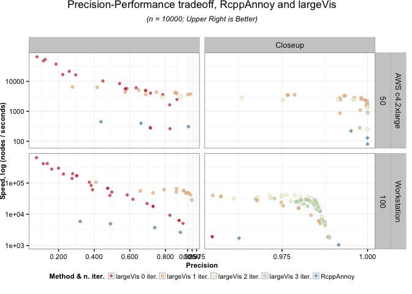
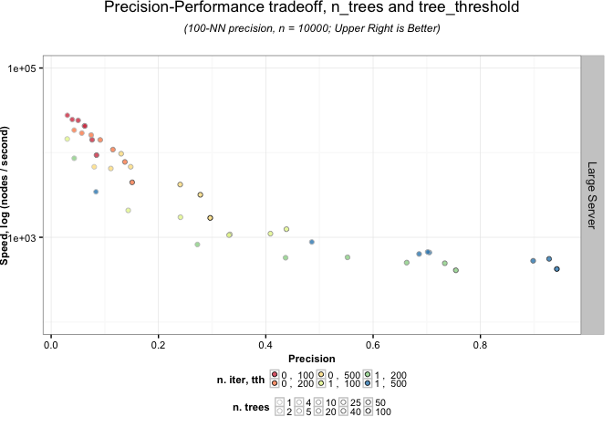
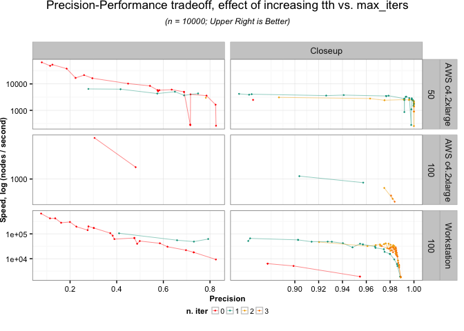

ANN Benchmarks
================
Amos Elberg
2016-11-11

Note:
-----

This was formerly a vignette benchmarking the performance of version 0.1.9 of the `largeVis` package. I have removed it as a vignette because of the overhead required to recalculate the benchmarks each time the code is refactored. Version 0.1.10 tested to be slightly (5-10%) faster in the Annoy phase, and significantly (30%) faster in the neighborhood iteration phase, than the benchmarks shown below would indicate.

Overview
--------

Besides manifold visualization, `largeVis` also includes an extremely efficient approximate nearest-neighbor search that runs in *O*(*n*) time.

This vignette includes benchmarks and recommendations for adjusting hyperparameters in the neighbor search for best results.

Hyperparameters
---------------

The `randomProjectionTreeSearch` function has three hyperparameters that trade-off accuracy and efficiency in the neighbor search:

1.  `n_trees` - In the first phase of the function, the number of random projection trees to create.
2.  `tree_threshold` - The maximum number of any nodes on a random projection tree leaf. If, after branching, the number of nodes in a branch exceeds this threshold, the branch will be divided again.
3.  `max_iters` - The number of iterations for the neighborhood-exploration phase of the algorithm.

Data Collection & Methodology
-----------------------------

The data in the benchmarks below was obtained by running the `benchmark.R` script, which is installed along with the package, on two machines.

The aim was to replicate as much as possible the methodology used by Erik Bernhardsson's [ANN Benchmark](https://github.com/erikbern/ann-benchmarks) github. However, `ANN Benchmark` is designed for libraries that are designed to build a neighbor index and then rapidly process queries against the index. The measure used by `ANN Benchmark` is therefore queries-per-second. By contract, `largeVis` is concerned with getting neighbors for all of the nodes in a finite dataset as quickly as possible.

Times shown for `RcppAnnoy` include the time to build a searchable index and query neighbors for all rows in the dataset.

The data used is the 1-million vector, 128-feature [SIFT Dataset](http://corpus-texmex.irisa.fr/), which is the test data used by `ANN Benchmark`.

Benchmarks were run on several machines. First, benchmarks were run on a workstation and a server with *K* = 100. Benchmarks were then run on an AWS c4.2xlarge instance with *K* = 100 and *K* = 50, to replicate as closely as possible the conditions of `ANN Benchmark`.

Results that appear to have used virtual memory, in that the completion time was radically discontinuous with other results from the same machine, were discarded.

I welcome submissions of output from the script from other hardware.

Comparison With Annoy
---------------------

The following chart illustrates performance versus the `Annoy` library, as implemented through the `RcppAnnoy` R package.

To facilitate comparison with the ANN Benchmark charts, the Y-axis shows the number of vectors processed per second.

Approximate Equivalence of Number of Trees and Tree Threshold
-------------------------------------------------------------

There is an approximate trade-off in memory use between the tree threshold and number of trees. Peak memory consumption during the tree search phase = N \* n\_trees \* threshold.

The trade-off is not precise because the tree split phase will return fewer nodes per tree than the threshold. On average, it should return about 3/4 of the threshold.

On the following chart, points that share the same values of n\_trees \* threshold, referred to as `tth`, (and number of neighborhood exploration iterations), are shown as the same series.

Results that hold nn constant while varying the number of trees and threshold tend to cluster together, however increasing the number of trees (while holding tth constant) tends to improve accuracy and decrease speed. The degree of dispersion increases when a neighborhood exploration iteration is added.

On the charts below, n\_trees \* threshold is referred to as `tth`.

Effect of Increasing `tth` vs. `max_iters`
------------------------------------------

Each line shows the precision-performance tradeoff that can be obtained by varying the number of trees and threshold while holding the number of iterations constant. As the chart shows, neighborhood exploration iterations move the precision-performance frontier outward. The marginal benefit of additional iterations declines as iterations are added.

This is consistent with the conclusions of the original paper authors.
