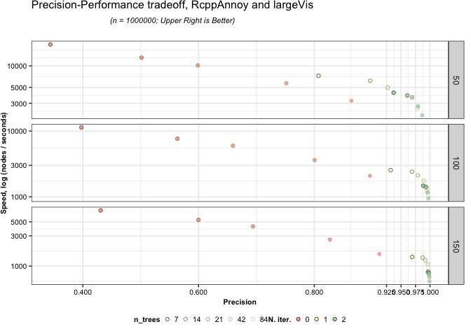

ANN Benchmarks
================
Amos Elberg
2021-03-30

## Overview

Besides manifold visualization, `largeVis` also includes an extremely
efficient approximate nearest-neighbor search that runs in *O*(*n*)
time.

This document includes benchmarks and recommendations for adjusting
hyperparameters in the neighbor search for best results.

## Hyperparameters

The `randomProjectionTreeSearch` function has two hyperparameters that
trade-off accuracy and efficiency in the neighbor search:

1.  `n_trees` - In the first phase of the function, the number of random
    projection trees to create.
2.  `max_iters` - The number of iterations for the
    neighborhood-exploration phase of the algorithm.

## Data Collection & Methodology

The data in the benchmarks below was obtained by running the
`benchmark.R` script, which is installed along with the package, on two
machines.

The benchmarks here are based on the methodology used by Erik
Bernhardsson’s [ANN
Benchmark](https://github.com/erikbern/ann-benchmarks) github. However,
`ANN Benchmark` measures the speed of querying against an index of
nearest neighbors. By contrast, `largeVis` is concerned with getting
neighbors for all of the nodes in a finite dataset as quickly as
possible.

The data used is the 1-million vector, 128-feature [SIFT
Dataset](http://corpus-texmex.irisa.fr/), which is the test data used by
`ANN Benchmark`.

The current set of benchmarks were run on my Macbook Air M1. You can run
the `benchmark.R` script to generate your own.

I welcome submissions of output from the script from other hardware.

## Comparison With Annoy

The following chart illustrates performance as the number of trees and
post-ANNOY iterations varies.

To facilitate comparison with the ANN Benchmark charts, the Y-axis shows
the number of vectors processed per second.

The chart shows that adding an iteration of the post-ANNOY phase of the
algorithm is a more efficient way of increasing precision than
increasing the number of trees. Note that with `n. iter. = 0`, the
algorithm is approximately equivalent to running `RcppAnnoy` alone.
