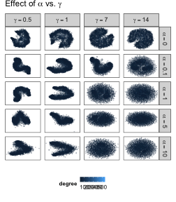
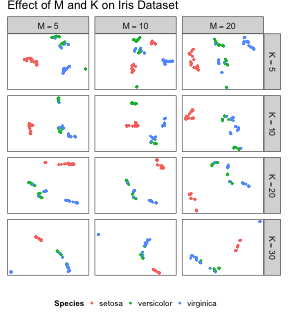

largeVis: An Implementation of the LargeVis Algorithm
=====================================================

This Vingette provides an overview of the largeVis package.  

## Introduction

This package provides `LargeVis` visualizations and fast nearest-neighbor search.  The `LargeVis` algorithm, presented in @tang2016visualizing, creates high-quality low-dimensional representaitons of large, high-dimensional datasets, similar to [t-SNE](https://lvdmaaten.github.io/tsne/).  

These visualizations are useful for data exploration, for visualizing complex non-linear functions, and especially for visualizing embeddings such as learned vectors for images. 

A limitation of t-SNE is that because the algorithm has complexity order $O(n^2)$, it is not feasible for use on even moderately sized datasets.  [Barnes-Hut](https://arxiv.org/pdf/1301.3342.pdf), an approximation of t-SNE, has complexity $O(n \log n)$ but also quickly becomes infeasible as the size of data grows. `LargeVis` is intended to address the issue by operating in linear $O(n)$ time.  It has been benchmarked at more than 30x faster than Barnes-Hut on datasets of approximately 1-million rows, and scaled linearly as long as there is sufficient RAM. 

In addition, `LargeVis` includes an algorithm for finding approximate k-Nearest Neighbors in $O(n)$ time. This algorithm turns out to be faster at finding accurate a-NNs than any other method I was able to test. 

The package also includes a function for visualizing image embeddings by plotting images at the locations given by the `LargeVis` algorithm.

For a detailed description of the algorithm, please see the original paper, @tang2016visualizing.

## Package Overview

The `largeVis` package offers five functions for visualizing high-dimensional datasets and finding approximate nearest neighbors (along with some helper functions):

1.  `randomProjectionTreeSearch`, a method for finding approximate nearest neighbors.
2.  `projectKNNs`, which takes as input a weighted nearest-neighbor graph and estimates a projection into a low-dimensional space.
3.  `largeVis`, which implements the entire `LargeVis` algorithm.
4.  `manifoldMap` (and companon `ggManifoldMap`), which produce a plot for visualizing embeddings of images. 
5. `buildWijMatrix` takes a sparse matrix of the distances between nearest neighbors, and returns one with the edges properly weighted for use in `projectKNNs`.

See the [original paper](https://arxiv.org/abs/1602.00370) for a detailed description of the algorithm. 

## Data Preparation

For input to `largeVis`, data should be scaled, NA's, Infs and NULL removed, and transposed from the R-standard so that examples are columns and features are rows. Duplicates should be removed as well.

If there are NA's, Infs, or NULLs in the input, `randomProjectionTreeSearch` will definitely fail. 

If the numerical range covered by the data is large, this can cause errors in or before the `buildEdgeMatrix` function. This is because the algorithm requires calculating $\exp(||\vec{x_i}, \vec{x_j}||^2)$ in the high-dimensional space, which will overflow if the distance between any nearest neighbors exceeds about 26.  

Duplicates in the input data are likely to cause issues.  If the number of duplicates is large, this can cause the random projection tree search to fail. If the number is small, the algorithm may identify a sufficient number of neighbors, but an error may then occur during `buildEdgeMatrix`, or stochastic gradient descent. 

## Overview of Functions and Hyperparameters

### `randomProjectionTreeSearch`

This function uses a two-phase algorithm to find approximate nearest neighbors. In the first phase, which is based on [Erik Bernhardsson](http://erikbern.com)'s [Annoy](https://github.com/spotify/annoy) algorithm, `n_trees` trees are formed by recursively dividing the space by hyperplanes until at most `tree_threshold` nodes remain in a branch.  A node's candidate nearest neighbors are the union of all nodes with which it shared a leaf on any of the trees.  The `largeVis` algorithm adds a second phase, neighborhood exploration, which considers, for each node, whether the candidate neighbors of the node's candidate immediate neighbors are closer. The logic of the algorithm is that a node's neighbors' neighbors are likely to be the node's own neighbors. In each iteration, the closest `K` candidate neighbors for each node are kept. 

(Note that this implementation of `largeVis` differs from the approach taken by `Annoy`, in that `Annoy` always uses the number of features as the leaf threshold, where `largeVis` allows this to be an adjustable parameter.)

The authors of @tang2016visualizing suggest that a single iteration of the second phase is generally sufficient to obtain satisfactory performance. 

See the vignette "ANN Benchmarks" for additional information.

### `projectKNNs`

This function takes as its input a `Matrix::sparseMatrix`, of connections between nodes. The matrix must be symmetric. A non-zero cell implies that node `i` is a nearest neighbor of node `j`, vice-versa, or both. Non-zero values represent the strength of the connection relative to other nearest neighbors of the two nodes. 

The `LargeVis` algorithm, explained in detail in @tang2016visualizing, estimates the embedding by sampling from the identitied nearest-neighbor connections. For each edge, the algorithm also samples `M` non-nearest neighbor negative samples. `M`, along with $\gamma$ and $\alpha$, control the visualization. $\alpha$ controls the desired distance between nearest neighbors. $\gamma$ controls the relative strength of the attractive force between nearest neighbors and repulsive force between non-neighbors.

The following grid illustrates the effect of the $\alpha$ and $\gamma$ hyperparameters:


```r
load(system.file(package = "largeVis", "vignettedata/vignettedata.Rda"))
```


The additional hyperparameters $\rho$ and `min-`$\rho$ control the starting and final learning rate for the stochastic gradient descent process. 

The algorithm can treat positive edge weights in two different ways. The authors of @tang2016visualizing suggest that edge weights should be used to generate a weighted sampling.  However, the algorithm for taking a weighted sample runs in $O(n \log n)$.  Alternatively, the edge-weights can be applied to the gradients.  This is controlled by the `weight_pos_samples` parameter. 

### `vis`

The `vis` function combines `randomProjectionTreeSearch` and `projectKNNs`, along with additional logic for calculating edge weights, to implement the complete `LargeVis` algorithm. 

The following chart illustrates the effect of the `M` and `K` parameters, using the `iris` dataset. Each row re-uses the same set of identified `K` neighbors, and initial coordinates. 



### `manifoldMap`

The `manifoldMap` function is useful when the examples being clustered are themselves images. Given a coordinate matrix (as generated by `projectKNNs` or `vis`) and an `array` of `N` images, the function samples `n` images and plots them at the coordinates given in the matrix. 

The following code will generate the visualization shown in the examples:


```r
dim(trainData) <- c(60000, 28, 28)
aperm(trainData, perm = c(1,3,2), resize = FALSE)
set.seed(1974)
manifoldMap(mnistCoords[,1:2],
    n = 5000,
    scale = 0.1,
    images = trainData,
    xlab = "", 
    ylab = "")
```

## Support for Sparse Matrices

`largeVis` supports sparse matrices.  Besides facilitating very large datasets, this makes it practicable to visualize term-document-matrices directly, and compare the result with the result of visualizing topic vectors. 

## Visualizing Graphs

The `largeVis` visualization algorithm can be used to visualize undirected weighted or unweighted acyclic graphs.  The included `wiki` dataset is an example.

The following code illustrates how to import and visualize a graph using the YouTube-communities dataset available [here](https://snap.stanford.edu/data/com-Youtube.html). The data and visualization are not included here for size reasons.


```r
youtube <- readr::read_tsv(pathToGraphFile, skip=4, col_names=FALSE)
youtube <- as.matrix(youtube)
youtube <- Matrix::sparseMatrix(i = youtube[, 1],
                                j = youtube[, 2],
                                x = rep(1, nrow(youtube)), 
                                dims = c(max(youtube), max(youtube)))
youtube <- youtube + t(youtube)
communities <- readr::read_lines(pathToCommunities)
communities <- lapply(communities, 
                      FUN = function(x) as.numeric(unlist(strsplit(x, "\t"))))
community_assignments <- rep(0, 
                             nrow(youtube))
for (i in 1:length(communities)) community_assignments[communities[[i]]] <- i

wij <- buildWijMatrix(youtube)
youTube_coordinates <- projectKNNs(youtube)
youTube_coordinates <- data.frame(scale(t(youTube_coordinates)))
colnames(youTube_coordinates) <- c("x", "y")
youTube_coordinates$community <- factor(community_assignments)
youTube_coordinates$alpha <- factor(ifelse(youTube_coordinates$community == 0, 0.05, 0.2))
ggplot(youTube_coordinates, aes( x = x, 
                      y = y, 
                      color = community, 
                      alpha = alpha, 
                      size = alpha)) +
  geom_point() +
  scale_alpha_manual(values = c(0.005, 0.2), guide = FALSE) +
  scale_size_manual(values = c(0.03, 0.15), guide = FALSE) +
  scale_x_continuous("", 
                     breaks = NULL, limits = c(-2.5,2.5)) +
  scale_y_continuous("", 
                     breaks = NULL, limits = c(-2.5,2.5)) +
  ggtitle("YouTube Communities")
```

## Distance Methods

The original `LargeVis` paper used Euclidean distances exclusively.  The `largeVis` package offers a choice between Euclidean and Cosine distance measures.  

The implementation is not optimized for cosine distances. 

## Memory Consumption

The algorithm is necessarily memory-intensive for large datasets. 

A simple way to reduce peak memory usage, is to turn-off the `save_neighbors` parameter when running `vis`. If this is insufficient, the steps of the algorithm can be run separately with the `neighborsToVectors`, `distance`, and `buildEdgeMatrix` functions.  In this case, the workflow is:


```r
neighbors <- randomProjectionTreeSearch(largeDataset)
edges <- buildEdgeMatrix(data = largeDataset, neighbors = neighbors)
rm(neighbors)
gc()
wij <- buildWijMatrix(edges)
rm(edges)
gc()
coords <- projectKNNs(wij)
```

Note that `gc()` is being called explicitly. The reason is that R will not collect garbage while executing the package's C++ functions, which can require substantial temporary RAM. 

Memory requirements during the neighbor search may be managed by reducing `n_trees` and increasing the `tree_threshold`. The decrease in precision is marginal, and may be compensated-for by increasing `max_iters`.  See the benchmarks vignette for further detail.

## References


