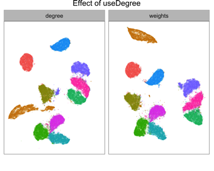
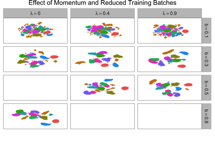
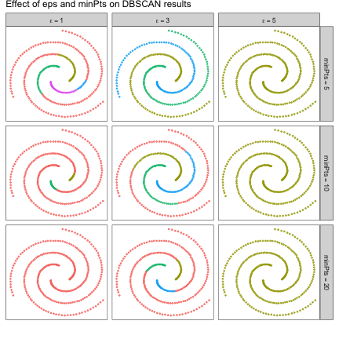
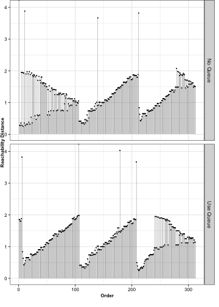
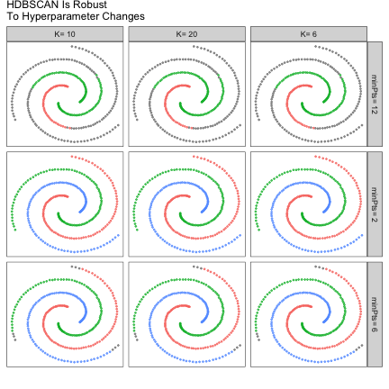

New Features in largeVis 0.1.10
===============================

Version 0.1.10 of `largeVis` adds two features that were not part of the original `LargeVis` paper:  

	*	The SGD phase of the LargeVis algorithm can be accelerated using momentum training.
	*	The method for calculating weights in the negative sampling phase of the algorithm is now a parameter.
	
In addition, that package includes implementations of the `DBSCAN`, `OPTICS`, and `HDBSCAN` clustering algorithms optomized to take advantage of the neighbor data generated by `largeVis`. 

## Negative Sampling

During the stochastic gradient descent phase of `largeVis`, \code{M} nodes that do not have edges to the current point are sampled along with each edge. In the original paper, the negative nodes are selected by sampling weighted according to their degree raised to the $\frac{3}{4}$ power. In the reference implementation, however, the nodes are weighted according to $P_n(j) \propto (\sum_{i \iff j \in N_i} w_{ij})^{0.75}$. 

Versions of `largeVis` prior to 0.1.8 (i.e., before the reference implementation became available) used degree. These results may be more aesthetically pleasing to many people. Version 0.1.10 therefore allows this to be set as a parameter. The default is to use edge weights, as in the reference implementation. 

The difference is that using edge weights, the resulting clusters tend to be more plainly convex. Using degree encourages a wider variation of irregular shapes. The effect is imperceptible at small data sizes; is subtle noticeable at around 50,000 nodes; but becomes pronounced on datasets of greater than 1 million nodes.  




## Momentum Training

Momentum training is method for optimizing stochastic gradient descent to encourage more rapid convergence.  The technique is common in deep learning.

Momentum alters the gradient so that in each iteration the algorithm calculates the update for each parameter taking into account prior update on the same parameter. If the gradient for a parameter has the same direction on one iteration as the previous, momentum will cause it to move further in that direction. If the gradient reverses, the update will be smaller than it would be otherwise. 

Without momentum, each iteration updates the low dimensional embedding according to the equation $\theta_{t + 1} = \theta_t + \rho\frac{dO}{d\theta_t}$

With momentum, this becomes:  $\theta_{t + 1} = \theta_t + \mu_t$ where $\mu_t = \rho\frac{dO}{d\theta_t} + \lambda\mu_{t - 1}$

The momentum paramter, $\lambda$, controls the rate of decay. 

Adding momentum can make it possible to reduce the number of sgd batches, in some cases substantially, without reducing the visual quality of the result. 




## Clustering

`largeVis` also includes three clustering algorithms:  `DBSCAN`, `OPTICS`, and `HDBSCAN`. 

The implementations here are not intended for general use. Rather, the `LargeVis` algorithm calculates, and `largeVis` retains, nearest neighbor information for inputs. Much of the computation time of the three clustering algorithms is spent identifying neighbors and calculating distances. The intent of these implementations is, by resuing the neighbor data generated by `largeVis`, to make it practical to apply these very computationally expensive algorithms to very large datasets. 

### Overview of Density Based Clustering

All three algorithms attempt to cluster points by linking a point to its nearest neighbors, using a modified definition of distance.  The `core distance` of a point is defined as the distance to its Kth nearest neighbor. It is an (inverse) measure of the density of space around a point. The `reachability distance` between two points is the greater of the distance between them and `core distances`.  When the neighbors of a point, $p$, are identified to link it with its nearest neighbors, no point $q$ can be closer to $p$ than $p$'s `core distance`. Thus, `reachability distance` combines both distance and density.  (Differences in the definition of `core distance` and `reachability distance` among the algorithms are not addressed here.)  

### DBSCAN

`DBSCAN` [@Ester96adensity-based] attempts to achieve a flat clustering using a consistent density threshold, $\epsilon$.  Points with more than `minPts` neighbors in their $\epsilon$-neighborhoods are `core points`.  Where the $\epsilon$ neighborhoods of corepoints overlap, the neighborhoods are merged into a single cluster. `DBSCAN` thus takes two hyper-parameters, $\epsilon$ and `minPts`. 

The objects returned by the `largeVis` `DBSCAN` implementation are compatible with the `dbscan` objects producted by package `dbscan`. [@hahsler]

The following chart illustrates the effect of the $\epsilon$ and `minPts` parameters on the performance of `DBSCAN`.



### OPTICS

`OPTICS` [@Ankerst:1999:OOP:304181.304187] applies similar logic as `DBSCAN` to build a hierarchical clustering. Beginning with a seed point, `OPTICS` finds the point with the lowest reachability distance (up to the cutoff, $\epsilon$) to any point already in the graph, and adds it. The result is an ordering of points by decreasing density. When there are no points with a `reachability distance` to the graph less than $\epsilon$, `OPTICS` begins again with a new seed point.  

This implementation of `OPTICS` has a hyperparameter `useQueue` which controls the order in which points are processed. In effect, this controls what points will be the first point in newly discovered clusters. The reachability graph above used `useQueue = FALSE`, which is used by the `dbscan` package and the `ELKI` implementation. If `useQueue` is set to `TRUE`, then the algorithm will use 
points in denser regions of the space as the seeds for new clusters.

This is illustrated in the following `reachability plots` for the spiral dataset:



`OPTICS` can be thought of as a hierarchical generalization of `DBSCAN`. `OPTICS` clusterings are readily convertible to `DBSCAN` clusterings by cutting clusters when the `reachability distance` exceeds a threshold. This can be done using the `extractDBSCAN` function of the `dbscan` package. The resulting clusters are identical to what would be obtained using `DBSCAN` with the same parameters, except in assignment of noise points. (This is not shown, to avoid creating a dependency on the `dbscan` package.) 


```r
suppressWarnings(opticsPoints <- do.call(rbind, Map(f = function(x) {
		clust = thiscut <- dbscan::extractDBSCAN(optClust, x)$cluster
		data.frame(cluster = clust, eps = x)
	}, c(1, 3, 5))))
opticsPoints$cluster <- factor(opticsPoints$cluster)
opticsPoints$x <- rep(dat[, 1], 3)
opticsPoints$y <- rep(dat[, 2], 3)
opticsPoints$eps <- factor(paste("epsilon ==" , opticsPoints$eps, sep = ""))

ggplot(data = opticsPoints, aes(x = x, y = y, color = cluster)) +
	geom_point(size = 0.5, alpha = 0.7) +
	facet_grid(. ~ eps, labeller = label_parsed) + 
	scale_x_continuous("", breaks = NULL) +
	scale_y_continuous("", breaks = NULL) +
	guides(color = FALSE) +
	ggtitle("OPTICS Clusters With EPS Cuts")
```

The `dbscan` package has other functions for cutting and visualizing `OPTICS` clusterings as well. The `optics` objects produced by `largeVis` are compatible with the ones produced by the `dbscan` packag.

### HDBSCAN

`HDBSCAN` [@Campello2013] aims to make the `DBBSCAN` and `OPTICS` approach flexible for graphs with different densities in different regions, by building a hierarchical density-bsaed clustering from which flat clusters are extracted.  `HDBSCAN` does not need the $\epsilon$ hypterparameter, which can be difficult to set. Rather, `HDBSCAN`, in effect, determines different values for $\epsilon$ for different parts of the dataset. 



The `largeVis` implementation of `HDBSCAN` produces flat and hierarchical clusterings simultaneously.  The hiearchical clusterings are compatible with `hclust` and other R hierarchical clustering packages and tools by means of an `as.dendrogram.hdbscan` function, which converts them to standard R dendrograms.  The package also includes a function for visualizing the clustering.  

## References
